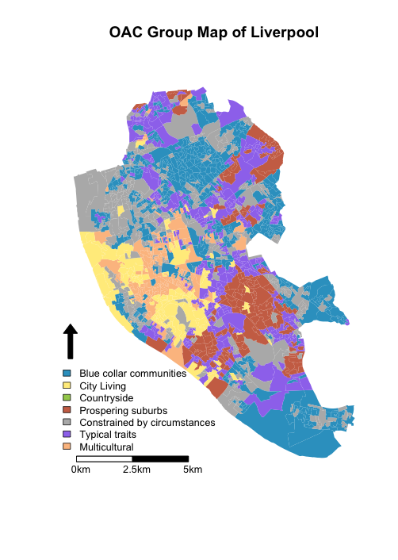

Using R for Geodemographic Analysis
=================

## R Basics

R began as a statistics program, and is still used as one my many users. At a simple level you can type in "3 + 4", press return, and R will respond "7". The code you type in in this tutorial is shown like this:


```r
3 + 4
```

And R's output is shown like this: 


```
[1] 7
```

R has developed into a GIS as a result of user contributed packages, or libraries, as R refers to them. We will be using several libraries in this practical, and will load them as necessary. 

*If you are using this worksheet outside of the course, you may need to install the R libraries as well as loading them. To do this, run 'install.package("package_name")'.*

We won't spend too much time on the basics of using R - if you want to find out more, there are some good tutorials at http://www.social-statistics.org/?p=764 or http://rpubs.com/nickbearman/gettingstartedwithr. 

We are going to use a program called [R Studio](http://www.rstudio.com/ "R Studio website"), which works on top of R and provides a good user interface. I'll talk a little bit about it in the presentation, but the key areas of the window are these:


Open up R Studio (click Start > All Programs > RStudio > RStudio or double-click the icon on the desktop) and arrange the windows so you can see the instructions in the web browser along side R Studio. 

## Index Scores

Index scores are an important part of geodemographic classification as they show how the rate of a particular characteristic is for that particular geodemographic group compared to the national average. 

For example, the table below shows index scores for broadsheet and tabloid  newspaper readership. A score of 100 indicates an OAC SuperGroup where newspaper readership is the same as the national average. The City Living SuperGroup have a score of 144 for broadsheet newspapers, which means the readership of broadsheet newspapers for them is 44% higher than the national average. The Blue Collar Communities SuperGroup have an index score of 73.2, which means their readership of broadsheet newspapers is 21.8% lower (100-73.2 = 21.8) than the national average. 

**Table 1: Index Scores for broadsheet and tabloid newspaper readership**


<!-- html table generated in R 3.0.3 by xtable 1.7-1 package -->
<!-- Thu Jul  3 14:00:33 2014 -->
<TABLE border=1>
<TR> <TH> OAC SuperGroup </TH> <TH> Broadsheet Index Score </TH> <TH> Tabloid Index Score </TH>  </TR>
  <TR> <TD> Blue Collar Communities </TD> <TD align="right"> 73.2 </TD> <TD align="right"> 110.8 </TD> </TR>
  <TR> <TD> City Living </TD> <TD align="right"> 144.0 </TD> <TD align="right"> 82.2 </TD> </TR>
  <TR> <TD> Countryside </TD> <TD align="right"> 103.9 </TD> <TD align="right"> 104.9 </TD> </TR>
  <TR> <TD> Prospering Suburbs </TD> <TD align="right"> 109.1 </TD> <TD align="right"> 94.5 </TD> </TR>
  <TR> <TD> Constrained by Circumstances </TD> <TD align="right"> 78.2 </TD> <TD align="right"> 108.4 </TD> </TR>
  <TR> <TD> Typical Traits </TD> <TD align="right"> 97.1 </TD> <TD align="right"> 96.4 </TD> </TR>
  <TR> <TD> Multicultural </TD> <TD align="right"> 120.2 </TD> <TD align="right"> 96.0 </TD> </TR>
   </TABLE>


We are going to make a graph of these values. We're using the `ggplot2` library, but there are many different ways of creating a graph. 

When writing code for R, as with any programming language, it is good to include comments - these are bits of text that R ignores, but we can use them to explain what is happening. In R, these are lines that start with a #. This is useful if we pass our code on to someone else (so they know what the code is doing) and for ourselves, when we come back to a piece of code six months later and can't remember what it was for!

The code below creates a graph of the index scores. We are going to take this code, and alter it to show the Tabloid news paper data. 

In the R Studio window, click New (top-left) and choose R Script (or use Ctrl-Shift-N):


Copy all the code in the section below and paste it into the R script window at the top. To run the code,  highlight the bit of code you want to run and then either click the 'Run' button (top right) or, and then press Ctrl-Enter on the keyboard (hold down Control and press Enter). R should create the graph, as shown in this document. If you get red error messages, check you have copied all of the code and not missed any bits out. 


```r
#Load libraries
  library(scales)
  library(ggplot2)
#set up data and data frame
  oac_names <- c("Blue Collar Communities","City Living","Countryside","Prospering Suburbs","Constrained by Circumstances","Typical Traits","Multicultural")
  broadsheets <- c(73.2, 144, 103.9, 109.1, 78.2, 97.1, 120.2)
  oac_broadsheets <- data.frame(oac_names,broadsheets)
#convert the percentage values (e.g. 144%) to decimal increase or decrease (e.g. 0.44)
  oac_broadsheets$broadsheets <-  broadsheets / 100 - 1
#select the colours we are going to use
  my_colour <- c("#33A1C9","#FFEC8B","#A2CD5A","#CD7054","#B7B7B7","#9F79EE","#FCC08F")
#plot the graph - this has several bits to it           
#the first three lines setup the data and type of graph
  ggplot(oac_broadsheets, aes(oac_names, broadsheets)) + 
    geom_bar(stat = "identity", fill = my_colour, position="identity") + 
    theme(axis.text.x=element_text(angle=90,hjust=1,vjust=1,size=12)) + 
  #this line add the lables to each bar
    geom_text(aes(label = paste(round(broadsheets * 100,digits = 0), "%"), vjust = ifelse(broadsheets >= 0, -0.5, 1.5)), size=3) +
  #these lines as the axis labels and these fonts
    theme(axis.title.x = element_text(size=12)) + 
    theme(axis.title.y = element_text(size=12)) + 
    scale_y_continuous("Difference from national average for broadsheet",labels = percent_format()) +
    scale_x_discrete("OAC SuperGroups")
```

 


This code uses the `ggplot` function to create a nice looking graph of the index scores (above). There is quite a lot going on in this code, but don't worry about trying to understand every command at this point. The key aspect is the `oac_broadsheets` data frame - this is where the data for the graph is stored. You can find out more about any R command by typing `?_command_` into the console. For example, `?ggplot`.

Now instead of broadsheet readership, we will create a graph for tabloid readership. Firstly in the code you copied into the R Script window, replace this line:


```r
broadsheets <- c(73.2, 144, 103.9, 109.1, 78.2, 97.1, 120.2)
```

with this


```r
tabloids <- c(110.8,82.2,104.9,94.5,108.4,96.4,96.0)
```

As we're doing tabloids now, we need to replace any instance of broadsheets with tabliods. Change:


```r
oac_broadsheets <- data.frame(oac_names,broadsheets)
```

to 


```r
oac_tabloids <- data.frame(oac_names,tabloids)
```

And do the same for the rest of the code.

You should end up with a graph like this:

 


This is our new graph! Compare it with the graph above. What does it tell us about the readership of different areas? Is this a surprise?

## Geodemographic Map of Liverpool

Now that we know the newspaper readership, it would also be useful to know how the different geodemographic classifications are distributed across Liverpool. We are going to use the 2001 version of the Output Area Classification (OAC) as described in the presentation. However, first of all we need to read in a shapefile for Liverpool. We are going to be using the 2001 Census geography of Output Areas. 

R uses what it calls a working directory, which is a folder where it will store the files you are currently working on. In the 'Documents' folder, create a folder called 'GIS'. We will then tell R to use this folder as its working directory. Run the command below. 


```r
# Set working directory
setwd("M:/Documents/GIS")
```


All the data we are using is freely available, and while some of it has already been prepared for you, you don't need to be based at a University to access it. For example, the 2001 Output Area data is available from 
https://geoportal.statistics.gov.uk/geoportal/catalog/main/home.page by searching for Output areas (E+W) 2001 Boundaries (Generalised, Clipped). I have already downloaded this data, and just clipped out the Liverpool area for this exercise. 

To read in the data, we need to load another library - `maptools`. Run the lines of code below which will download and read in the data. 


```r
#load library
library(maptools)
#download file
download.file("https://raw.githubusercontent.com/nickbearman/r-geodemographic-analysis-20140710/master/liverpool_OA.zip", "liverpool_OA.zip", method = "internal")
#unzip file
unzip("liverpool_OA.zip")
#read in shapefile
liverpool <- readShapeSpatial('liverpool_OA/liverpool', proj4string = CRS("+init=epsg:27700"))
```


This will read in the shapefile to a SpatialPolygonsDataFrame called `liverpool`. We can have a quick look at the data using the `plot` command. Run:


```r
plot(liverpool)
```

 

This just contains the spatial information, showing where the Output Areas are. We also need to know which Output Areas are in which SuperGroup. 


- Go to http://www.ons.gov.uk/ons/guide-method/geography/products/area-classifications/ns-area-classifications/index/datasets/output-areas/output-areas.html 
- Click **Cluster Membership - Output Areas** (on the right hand side)
- Choose **Download**  and click **Next**
- Choose the **North-West** option
- Download the CSV file
- Extract the files from the zip file and move `J31A0301_2101_GeoPolicy_NW_OA.CSV` to your working folder. 

Now run this code to read in the CSV file and rename the columns.


```r
#read in OAC by OA csv file
OAC <- read.csv("J31A0301_2101_GeoPolicy_NW_OA.csv",header=TRUE,skip=5)
#select certain columns
OAC <- subset(OAC, select = c("OA_CODE","DATA_VALUE","DATA_VALUE.1","DATA_VALUE.2","DATA_VALUE.3","DATA_VALUE.4","DATA_VALUE.5"))
#rename columns
colnames(OAC) <- c("OA_CODE","Supergroup Name","Supergroup Code","Group Name","Group Code","Subgroup Name","Subgroup Code")
```

## Joining Data

The next stage is to join this data onto the data slot of the OA object. This code uses the `match()` function to examine which rows in the `OAC` data frame match with those in the `liverpool@data` dataframe. The matches are done using the OA code columns in both objects. If you print the first few rows of the data slot for both objects, you will see the fields we will be matching.


```r
#print first six rows for the data frames we will be joining
head(liverpool@data)
```

```
     OA01CD  OA01CDOLD
0 E00032985 00BYFA0001
1 E00032986 00BYFA0002
2 E00032987 00BYFA0003
3 E00032988 00BYFA0004
4 E00032989 00BYFA0005
5 E00032990 00BYFA0006
```

```r
head(OAC)
```

```
     OA_CODE    Supergroup Name Supergroup Code                Group Name
1 00BLFA0001 Prospering Suburbs               4          Prospering Semis
2 00BLFA0002     Typical Traits               6        Settled Households
3 00BLFA0003     Typical Traits               6        Settled Households
4 00BLFA0004     Typical Traits               6           Least Divergent
5 00BLFA0005 Prospering Suburbs               4 Prospering Older Families
6 00BLFA0006 Prospering Suburbs               4          Prospering Semis
  Group Code Subgroup Name Subgroup Code
1         4c            ..           4c1
2         6a            ..           6a1
3         6a            ..           6a2
4         6b            ..           6b3
5         4b            ..           4b2
6         4c            ..           4c2
```

We are joining the `OA01OLD` and the `OA_CODE` fields - you should be able to see that the first few match. The code below joins them together, and then does another `head()` command to show the joined data. 


```r
#Join OAC classification on to LSOA shapefile
liverpool@data = data.frame(liverpool@data, OAC[match(liverpool@data[, "OA01CDOLD"], OAC[,"OA_CODE"]),])
#Show head of liverpool
head(liverpool@data)
```

```
     OA01CD  OA01CDOLD    OA_CODE Supergroup.Name Supergroup.Code
0 E00032985 00BYFA0001 00BYFA0001     City Living               2
1 E00032986 00BYFA0002 00BYFA0002     City Living               2
2 E00032987 00BYFA0003 00BYFA0003   Multicultural               7
3 E00032988 00BYFA0004 00BYFA0004     City Living               2
4 E00032989 00BYFA0005 00BYFA0005     City Living               2
5 E00032990 00BYFA0006 00BYFA0006     City Living               2
                  Group.Name Group.Code Subgroup.Name Subgroup.Code
0      Transient Communities         2a            ..           2a2
1      Transient Communities         2a            ..           2a2
2 Afro-Caribbean Communities         7b            ..           7b1
3        Settled in the City         2b            ..           2b2
4      Transient Communities         2a            ..           2a2
5      Transient Communities         2a            ..           2a2
```

## Lunch

This is where I am planning to break for lunch, depending how the timing goes. If you get to this point before lunch, feel free to experiment with the code you have been using and see if you can apply some of it to your own data. 

We also have the index scores for individual newspaper titles (https://raw.githubusercontent.com/nickbearman/r-geodemographic-analysis-20140710/master/newspapers_full.csv). If you have time, see if you can make a graph for one of these newspapers. Remember to change the axis label as well!

## Mapping the Data

Now we have the data prepared, we can map it. Creating a map in R has several stages to it, which we will go through. The first stage is just to plot the map. To do this, we also need to select which colours we want to use for each category. This is done in the lines below, using hexadecimal colour codes. Copy this code into a script and run it. 


```r
#Define a set of colours, one for each of the OAC supergroups
my_colour <- c("#33A1C9","#FFEC8B","#A2CD5A","#CD7054","#B7B7B7","#9F79EE","#FCC08F")
#Create a basic OAC choropleth map
plot(liverpool, col=my_colour[liverpool@data$Supergroup.Code], axes=FALSE,border = NA)
```

 

This shows us the map, but we also need a legend and other details on it. The second stage adds these details. Copy the code below into your script, and run it. 


```r
#Name the groups we've used
oac_names <- c("Blue collar communities","City Living","Countryside","Prospering suburbs","Constrained by circumstances","Typical traits","Multicultural")
#Add the legend (the oac_names object was created earlier)
legend(x=332210, y=385752, legend=oac_names, fill=my_colour, bty="n", cex=.8, ncol=1)
#Add North Arrow
SpatialPolygonsRescale(layout.north.arrow(2), offset= c(332610,385852), scale = 1600, plot.grid=F)
#Add Scale Bar
SpatialPolygonsRescale(layout.scale.bar(), offset= c(333210,381252), scale= 5000, fill= c("white", "black"), plot.grid= F)
#Add text to scale bar 
text(333410,380952,"0km", cex=.8)
text(333410 + 2500,380952,"2.5km", cex=.8)
text(333410 + 5000,380952,"5km", cex=.8)
#Add a title
title("OAC Group Map of Liverpool")
```

Your map should end up looking something like this:



There is quite a lot happening here, so here is a bit of explanation. The pairs of six digit numbers represent the location of the different objects. When you plot a graph in R, the coordinates are set to the same as the spatial data (BNG in this example). So you also have to position the map items in BNG coordinates. Secondly, you can see the `cex=` command used quite a bit. This tells R to scale that item. A value of 1 represents 100%, so 0.8 get R to reduce the item in size by 20%. Try adjusting the size. 

If you just re-run one line, R will just add that again to the plot. This can be useful if you are experimenting with the position, but you may need to run the whole block of code again to see what is going on. There is a function called `locator()` which can help you find coordinates. Run `locator()` in the console, then click anywhere in the plot window, and then click finish (top-right of the plot window). R will then give you the coordinates of where you clicked. 

Experiment with adjusting the different elements, size, location and colour. How do you think you would add a data source to the map?


## Calculating Index Scores

I've provided the index scores for you, but where do they come from? When creating the 2001 OAC, they also created a OAC Grand Index, which is a series of index scores for different variables cross tabulated against OAC SuperGroups, Groups and SubGroups. We've already used the index scores for tabloid and broadsheet newspapers, but we also have index scores for individual titles. This data has come from the Grand Index, which you can download it from http://areaclassification.org.uk/2010/09/07/oac-grand-index/. Have a look and see what different variables you might find useful. 

We are going to use them in an example below, but before that I want to explain briefly how they are calculated. It is calculated as a ratio, with 100 being the national average. Let's say we have 1,435,000 broadsheet newspaper readers nationally, out of a total of 4,966,590 newspaper readers. Within the Blue Collar Communities we have 135,000 readers out of 639,000 readers in total (in the Blue Collar Communities). The index score (of broadsheet newspaper readers in the Blue Collar Community SuperGroup) is:

$$
\frac{\text{Broadsheet readers in Blue Collar Communities}} {\text{Total National Broadsheet readers}} / \frac{\text{Total Readers in Blue Collar Communities}} {\text{Total National Newspaper Readers}} * 100
$$
  
  
If we put some numbers in:

$$
\frac{135,000} {1,435,000} / \frac{639,000} {4,966,590} * 100 = 73.1
$$

*The numbers don't quite match with the table at the beginning (73.2) because of rounding. These numbers are based on http://www.pressgazette.co.uk/uk-newspapers-ranked-total-readership-print-and-online, for August 2013, accessed 2nd July 2014.*


## Using OAC Index Scores in an example

If we decide to open a corner shop in a particular location then it might be useful to know what newspapers we are likely to sell most of. We know which OAC Group our corner shop falls into, and we know which classifications tend to read which newspapers, so we can combine the two together to work out which newspapers to stock. 

I've cut out a subset from the Grand Index mentioned above, and you can load this from a CSV file:


```r
#download file
download.file("https://raw.githubusercontent.com/nickbearman/r-geodemographic-analysis-20140710/master/newspapers_full.csv", "newspapers_full.csv", method = "internal")
#Read in CSV file called newspapers_full.csv
newspapers_full <- read.csv("newspapers_full.csv",header=TRUE)
#print the whole data frame to view it
newspapers_full
```


This gives us the index scores. For example, newspaper readers from the Blue Collar Communities are less likely than average to read the Independent. Our proposed corner shop is at coordinates 341442,388619 which we can plot on to the map using: (if the map isn't visible, then re-run the code to plot the map)


```r
text(341442,388619,"X", cex=1.2)
```

Our shop is in the 'Prospering Suburbs' SuperGroup, and we can see from the table that it's probably worth stocking the Daily Telegraph, the Times and the Daily Mail. 

What about the Financial Times? What other things might it be worth considering which papers to stock? 

----- 


This work is licensed under the Creative Commons Attribution-ShareAlike 4.0 International License. To view a copy of this license, visit http://creativecommons.org/licenses/by-sa/4.0/deed.en. Based upon [Getting Started with R](http://rpubs.com/nickbearman/gettingstartedwithr) by Nick Bearman.

This page is http://rpubs.com/nickbearman/r-geodemographics and all the files are available in a [GitHub repository](https://github.com/nickbearman/r-geodemographic-analysis-20140710 "GitHub repository"). Feel free to make use of these exercises and/or [fork](https://guides.github.com/activities/forking/ "Forking Projects") this work. This worksheet was created using R 3.0.3 and R Studio 0.98.507 on OSX and tested on Microsoft Windows 7 using R 3.0.1 and R Studio 0.98.507 on 03/07/2014 by [Nick Bearman](https://www.linkedin.com/in/nickbearman "Nick Bearman Linkedin Profile"). 
